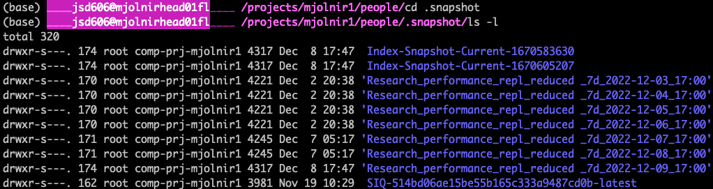

Backup
======

In most directories there is a hidden directory called ``.snapshot``. This is your savour. Here you will a daily backup with a snapshot of your data. The data is kept for 7 days, unless there is a lack of diskspace. You should therefore not rely on that you can always retrieve your files again.

