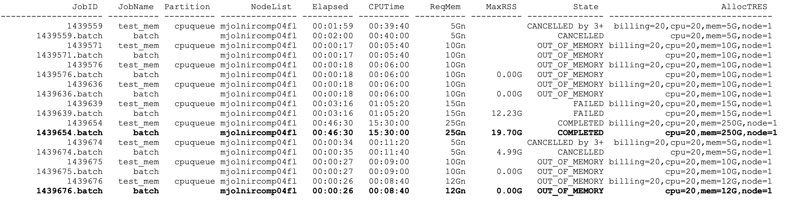

Monitoring Jobs
*****

After submitting a job to SLURM, it's important to monitor its status to check if it's running, has finished, or has encountered any errors. Here are some useful commands for monitoring SLURM jobs:

List jobs in the queue: `squeue`
-------

The `squeue` command lists all of the current jobs in the SLURM queue, including their job ID, status, and other information. Running `squeue` with no arguments will show all jobs in the queue, but you can also filter the output to show only your own jobs, for example, with the `-u` flag followed by your username:

.. code-block:: console

    $ squeue -u yourusername
    
When you list your jobs, you will find that each job has a state. Some of the poossible states are listed below with their explanation:

- **PD**: Pending - Job is awaiting resource allocation.
- **R**: Running - Job currently has an allocation.
- **CG**: Completing - Job is completing (cleaning up after itself).
- **CD**: Completed - Job has terminated all processes.
- **CA**: Cancelled - Job was explicitly cancelled by the user or system administrator.
- **F**: Failed - Job terminated with non-zero exit code or other failure condition.
- **TO**: Timeout - Job terminated upon reaching its time limit.
- **NF**: Node Failure - Job terminated due to a failure of one or more nodes.
- **RV**: Revoked - Job was preempted by another job or manually killed by a privileged user.
- **PR**: Preempted - Job was preempted by a higher priority job.
- **SE**: Suspended - Job has been suspended by the user or system administrator.

Detailed job information: `scontrol`
--------

The `scontrol` command provides more detailed information about a specific job, such as its status, start and end times, and resources used. You can use `scontrol` to check the status of a job by specifying its job ID:

.. code-block:: console

    $ scontrol show job jobID

Summary of completed jobs: `sacct`
-----

The `sacct` command provides a summary of all completed jobs, including their start and end times, exit code, and other information. To view information about your own jobs, you can use the `--user` flag followed by your username:

.. code-block:: console

    $ sacct --user yourusername

You can also use various options to filter the output by time, job status, and other criteria. For more information on using `sacct`, you can run `man sacct` in the terminal.

By using these commands, you can keep track of your jobs in SLURM and quickly identify any issues that may arise during the job's execution.

Summary of completed jobs: `sacct` - advanced
-----
The `sacct` command can be used in a more advanced manner, which can help you optimize your resource booking.
By using the following command, you can obtain a summary of your jobs for the past week:

(Replace "jsd606" with your own ku-id or replace "-u jsd606” with “- -allusers”)

.. code-block:: console

    $ sacct -u jsd606 --units=G --format "JobID%20,JobName,Partition,NodeList,Elapsed,CPUTime,ReqMem,MaxRSS,State%15, AllocTRES%32_" --starttime=$(date -d "1 week ago" +%Y-%m-%d)

**MaxRSS** reflects the highest amount of memory the job occupied in the main memory of the system

**Elapsed** refers to the elapsed time or duration of a job's execution. It represents the total amount of time that a job has been running, from its start to its completion or termination.

**CPUTime** refers to the total CPU time consumed by a job during its execution. It represents the amount of time that the job's processes spent actively using the CPU(s).

**AllocTRES** refers to the allocated resources for a job in SLURM => It is the resources you have booked.

Looking at the job status, it is evident that job **1439676** terminated with an “OUT_OF_MEMORY" error. This indicates a requirement for more memory than the currently booked 12GB. As the job was killed due to out-of-memory conditions, it is expected that the MaxRSS field may not be available or accurately reflect the job's memory usage, hence the 0.00G in MaxRSS.

On the other hand, job **1439654** utilized a maximum of 19.70GB, which is considerably less than the allocated 250GB. This signifies a substantial overbooking of resources, and the job could be successfully executed with lower resource allocation.

By comparing **AllocTRES** with **MaxRSS** and **Elapsed/CPUTime**, you can thereby optimize your job bookings more effectively for future jobs.

When **CPUTime** closely matches **Elapsed** and multiple CPUs have been reserved, it indicates that a significant portion of your computation did not involve multithreading. In such cases, it is advisable to reduce the number of CPUs booked.

Monitoring nodes
*****

The `sinfo` command is used to display information about nodes and partitions in the Slurm cluster.

To view all nodes in the cluster, use the following command:

.. code-block:: console

   $ sinfo

This will display a list of all nodes, their state, partition, and other information. You can use the `-p` option to filter by partition, like this:

.. code-block:: console

   $ sinfo -p <partition_name>

To view information about a specific node, use the following command:

.. code-block:: console

   $ sinfo -N <node_name>

This will display information about the specified node, including its state, partitions, and other information.

Below is a list of the most common node-states that you will find. 

- **alloc**: The node has been allocated to one or more jobs
- **comp**: All jobs associated with this node are in the process of COMPLETING
- **drain**: The node is currently executing a job, but will not be allocated additional jobs.
- **drained**: The node is unavailable for use per system administrator request.
- **down**: The node is unavailable for use.
- **idle**: The node is not allocated to any jobs and is available for use..
- **maint**: The node is currently in a reservation with a flag value of "maintenance".
- **mix**: The node has some of its CPUs ALLOCATED while others are IDLE.
- **planned**: The node is planned by the backfill scheduler for a higher priority job.
- **resv**: The node is in an advanced reservation for future use and not generally available.

You can use the `--format` option to customize the output of the `sinfo` command.

For more information about the `sinfo` command and its options, see the Slurm documentation or type `man sinfo` in the console.

